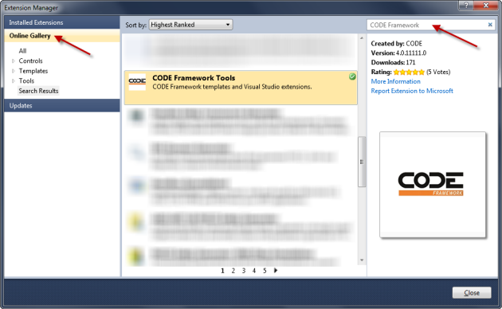
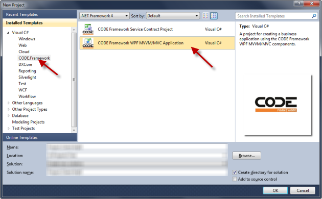
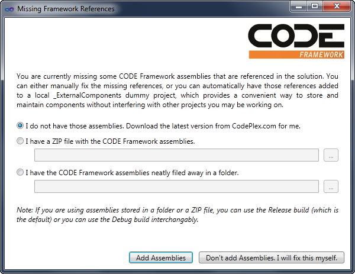

# CODE Framework Documentation
## Articles
We are in the process of writing a whole series of [Articles](Articles)(Articles) which will be published in CODE Magazine. Check out the [Articles](Articles)(Articles) page for more information.

## Quick Tips
We are in the process of compiling a list of "quick tips" (most of which are excerpts from internal EPS/CODE emails) which will all be published in the [Quick Tips](Quick-Tips) page.

## Articles and Whitepapers

### Building WPF MVVM/MVC Applications

* [General Overview: Writing WPF MVVM/MVC Applications (CODE Magazine article)](http://www.codemag.com/Article/1201061)
* [UI Building Overview: Building Productive, Powerful, and Reusable WPF (XAML) UIs with the CODE Framework (CODE Magazine article)](http://www.codemag.com/Article/1206101)
* [MessageBoxes in WPF MVVM/MVC](MessageBoxes-in-WPF-MVVM_MVC)
* [WPF MVVM/MVC Status Bar](WPF-MVVM_MVC-Status-Bar)
* [WPF MVVM/MVC Notifications](WPF-MVVM_MVC-Notifications)
* [Standard Icon Resources](Standard-Icon-Resources)
* [Standard Views and View Models](Standard-Views-and-View-Models)

### Building Middle Tiers

* [Building Services and SOA Business Layers (CODE Magazine Article)](http://www.codemag.com/Article/1203061)

## Change Logs
* [CODE Framework (.NET) Change Log](CODE-Framework-(.NET)-Change-Log)
* [CODE Framework Tools Change Log](CODE-Framework-Tools-Change-Log)

## More...

For further information and documentation on the CODE Framework, see [http://codeframework.io](http://codeframework.io).
## Quick Introduction to using the Framework
The easiest way to get started with the CODE Framework, is to install the _CODE Framework Tools_ Visual Studio Extension through the Visual Studio Extension Manager:

Once these extensions are installed, new project templates become available in Visual Studio, such as these:

Note that this does not install the actual framework, but only the tools. However, if you use a template that requires framework components (such as the CODE Framework WPF MVVM/MVC template), the tools detect the dependency and show a dialog like this:

Using this dialog, CODE Framework assemblies can be added to the current project, either by adding files stored locally in a folder or ZIP file (after having downloaded the desired version manually from CodePlex), or you can let the tool retrieve the latest version from CodePlex for you and add the assemblies directly.

Note that CODE Framework assemblies are generally not installed in the GAC (although you could do so yourself if you prefer this option) but they are put into a dummy location in the local solution. This has the advantage that different solutions built with the CODE Framework can use different versions without colliding with each other, and allowing the developer full control over when and to what version a certain solution is to be upgraded to. It also has the advantage that all external assemblies can be checked into source control, allowing other developers to simply join the project through source control without relying on additional installs. This also allows them to always retrieve the correct version of these dependencies automatically. This generally works very well for typical business applications.